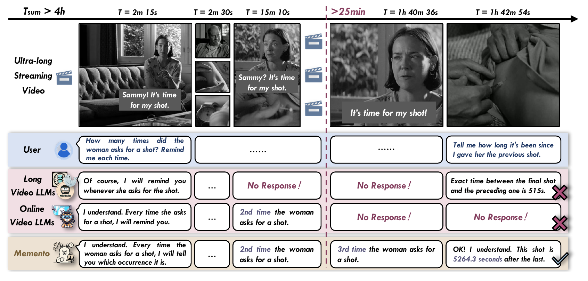
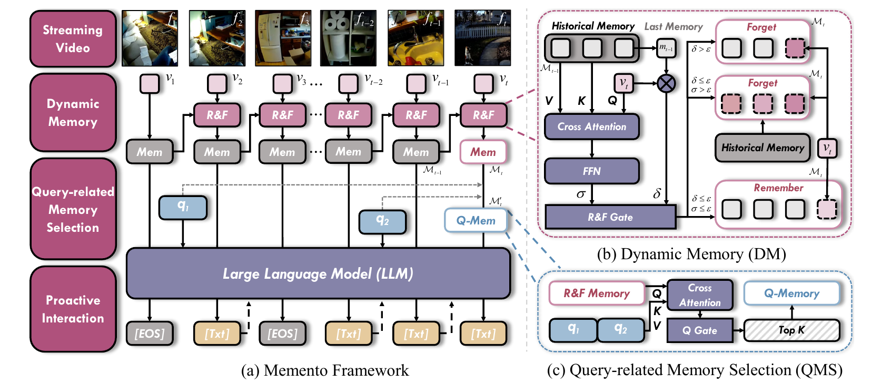

<div align="center">

# Memento

### Toward an All-Day Proactive Assistant<br>for Ultra-Long Streaming Video

## ICLR 2026

**Remember the stream. Respond at the right moment.**

[](https://openreview.net/forum?id=FtdbdoGbk3)
[](https://huggingface.co/liarzone/Memento-8B)
[](https://huggingface.co/datasets/liarzone/Memento-54K)
[](LICENSE)

[Overview](#overview) · [Method](#method) · [Quick start](#quick-start) · [Training](#training) · [Documentation](#documentation) · [Citation](#citation)

</div>

<br>

## Overview

**Memento** is a proactive video assistant that learns **when to respond** and **what to say** while a video stream unfolds. It combines a Llama-3.1 language model with a SigLIP vision encoder and memory designed for long video histories.

<p align="center">
  
  <br><sub>Figure 1. Comparison of model behaviors for all-day proactive assistance.</sub>
</p>

## Method

<p align="center">
  
  <br><sub>Figure 2. Overall architecture of Memento.</sub>
</p>

- **Dynamic Memory** compresses incoming visual history as the stream grows.
- **Query-related Memory Selection** retrieves the history relevant to the current question.
- **Step-Aware Memory Attention (SAMA)** restricts attention to the memory available at each training step.

## Models and data

| Resource | Description | Download |
| :--- | :--- | :--- |
| **Memento-8B** | LoRA adapter with trained visual and memory modules | [Hugging Face](https://huggingface.co/liarzone/Memento-8B) |
| **Memento-54K** | 53,626 training dialogues and 198 test dialogues | [Hugging Face](https://huggingface.co/datasets/liarzone/Memento-54K) |

The model uses [Llama-3.1-8B-Instruct](https://huggingface.co/meta-llama/Llama-3.1-8B-Instruct) and [SigLIP-Large-Patch16-384](https://huggingface.co/google/siglip-large-patch16-384). Download these base weights separately. Source videos are available through [Ego4D](https://ego4d-data.org/docs/start-here/); the dataset provides timestamped dialogues and video UID lists.

## Quick start

### 1. Install

Use Linux, Python 3.11, FFmpeg and an NVIDIA GPU with BF16 support. See the [environment guide](docs/getting_started.md#1-environment) for CUDA and multi-GPU requirements.

```bash
git clone https://github.com/XiangTodayEatsWhat/Memento.git
cd Memento
python3.11 -m venv .venv
source .venv/bin/activate
python -m pip install --upgrade pip
DS_BUILD_OPS=0 python -m pip install -r requirements.txt
python -m pip install -r requirements-publish.txt -r requirements-eval.txt
```

### 2. Download assets and prepare video features

```bash
hf auth login  # Requires access to the Llama 3.1 base model
python scripts/download_assets.py --kind base --output checkpoints/Llama-3.1-8B-Instruct
python scripts/download_assets.py --kind vision --output checkpoints/siglip-large-patch16-384
python scripts/download_assets.py --kind model --output checkpoints/Memento-8B
python scripts/download_assets.py --kind dataset --output datasets/Memento-54K
```

Follow [video download](docs/getting_started.md#3-download-source-videos) and [feature preparation](docs/getting_started.md#4-prepare-visual-features) to obtain Ego4D videos and encode them at 2 FPS. For evaluation only, download the test split.

### 3. Run streaming evaluation

After feature preparation:

```bash
FEATURES=$(python -c 'import json; print(json.load(open("datasets/prepared/prepared.json"))["feature_dir"])')

python scripts/evaluate.py \
  --annotations datasets/Memento-54K/data/test.jsonl \
  --features "$FEATURES" \
  --checkpoint checkpoints/Memento-8B \
  --llm checkpoints/Llama-3.1-8B-Instruct \
  --vision checkpoints/siglip-large-patch16-384 \
  --output outputs/evaluation \
  --gpus 0
```

This produces timestamped responses and temporal metrics. For answer-quality scoring with `gpt-3.5-turbo-0125`, follow the [evaluation guide](docs/getting_started.md#7-answer-quality-evaluation).

## Training

Prepare training features, then launch the released model's training recipe:

```bash
python scripts/train.py \
  --config configs/original_checkpoint.json \
  --annotations datasets/Memento-54K/data/train.jsonl \
  --features "$FEATURES" \
  --llm checkpoints/Llama-3.1-8B-Instruct \
  --vision checkpoints/siglip-large-patch16-384 \
  --output outputs/memento \
  --gpus 0,1,2,3
```

See [training](docs/getting_started.md#5-train) for configuration and resuming, and [export](docs/getting_started.md#8-export-a-trained-adapter) for packaging a trained model.

## Documentation

| Guide | Contents |
| :--- | :--- |
| [Getting started](docs/getting_started.md) | Environment → downloads → video features → training → evaluation → export |
| [Data format](docs/data.md) | Dialogue schema, splits, timestamps and visual features |
| [Evaluation protocol](docs/evaluation.md) | TimeRecall, Redundancy and answer-quality scoring |

<details>
<summary><b>Repository structure</b></summary>

```text
Memento/
├── configs/       Training recipes and DeepSpeed settings
├── data/          Dataset loaders and video preprocessing
├── models/        Vision, language and memory modules
├── engine/        Training engine
├── inference/     Streaming inference
├── benchmark/     Temporal metrics and answer-quality scoring
├── scripts/       Download, prepare, train, evaluate and export
├── docs/          Detailed guides
└── tests/         Metric regression tests
```

</details>

## Citation

```bibtex
@inproceedings{memento2026iclr,
  title = {Memento: Toward an All-Day Proactive Assistant for Ultra-Long Streaming Video},
  booktitle = {ICLR},
  year = {2026},
  url = {https://openreview.net/forum?id=FtdbdoGbk3}
}
```

## License

Code is released under [Apache-2.0](LICENSE). Annotations use [CC BY 4.0](https://huggingface.co/datasets/liarzone/Memento-54K/blob/main/LICENSE). Model weights follow the [Llama 3.1 Community License](https://huggingface.co/liarzone/Memento-8B/blob/main/LICENSE) and [Acceptable Use Policy](https://huggingface.co/liarzone/Memento-8B/blob/main/USE_POLICY.md). Ego4D videos retain their source-data terms. See [third-party notices](THIRD_PARTY_NOTICES.md).

<p align="center"><sub>Built with Llama.</sub></p>
